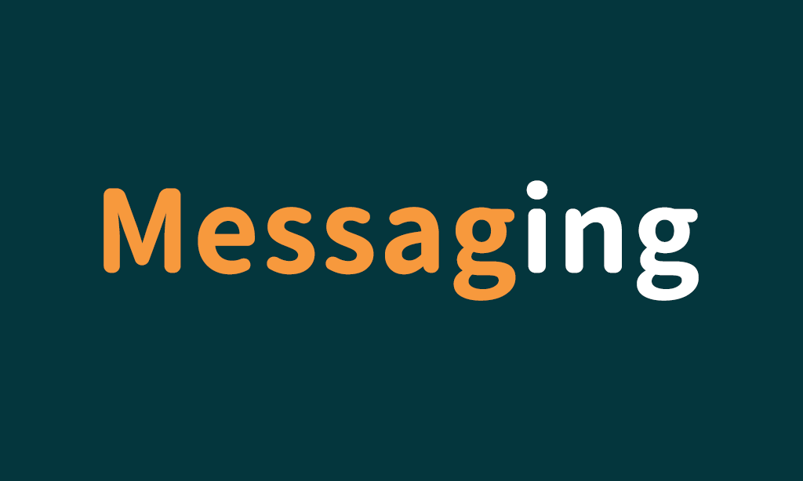
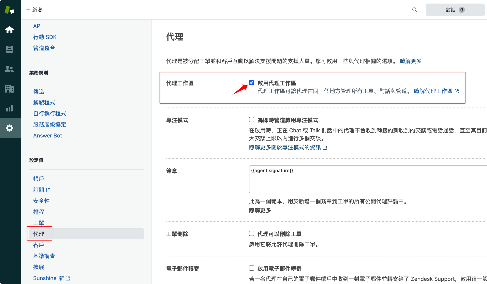
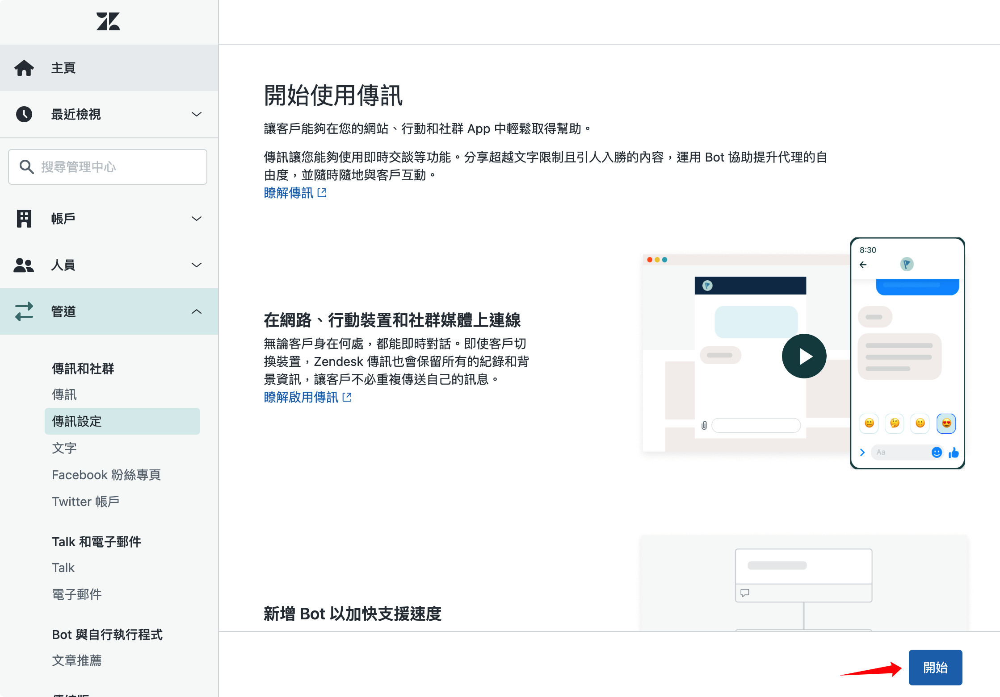
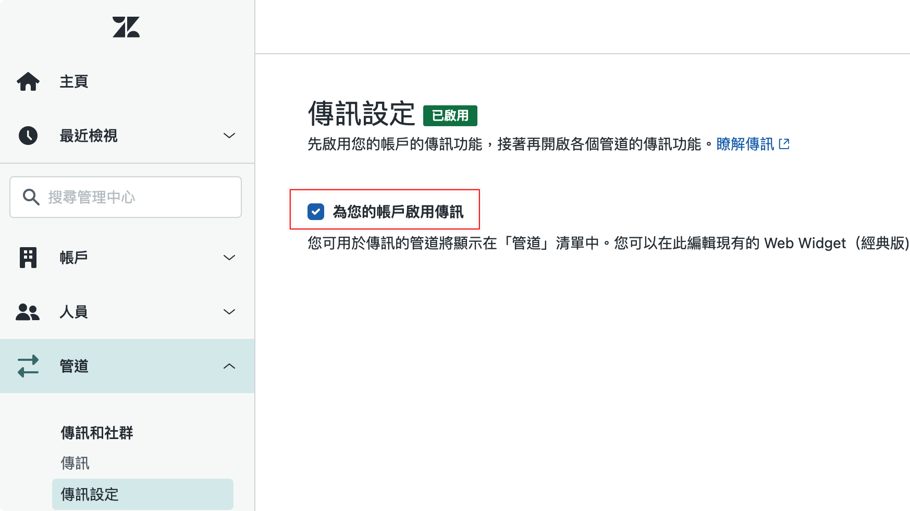
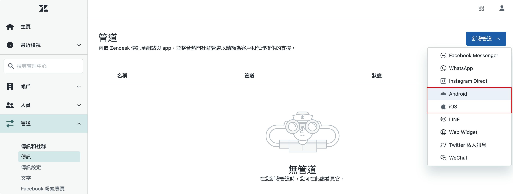
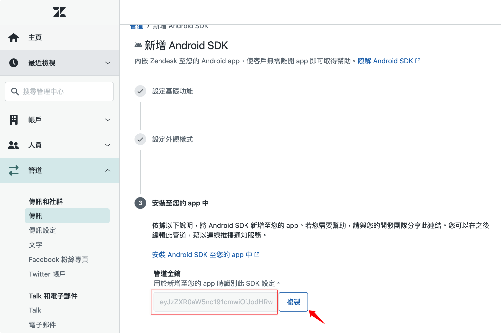

# Zendesk Messaging



**Messaging** is a "user-based" chat

**Live Chat** is a "session-based" chat
 
- **Better UI (Native)**
- **Chat history**
- **Answer Bot**

-------------------

## Setup
### 1. Enable agent work-space

### 2. Enable Messaging

### 

### 3. Add channel and get key

### 


## How to use?
### Initialize
``` dart
 final String androidChannelKey = '';
 final String iosChannelKey = '';

  @override
  void initState() {
    super.initState();
    ZendeskMessaging.initialize(
      androidChannelKey: androidChannelKey,
      iosChannelKey: iosChannelKey,
    );
  }
```
> just use initialize() one time

### Show
```dart
ZendeskMessaging.show();
```
> You can use in onTap()

## Weak
- **Authentication**：`Currently does not support.` Unable to automatically set user information for users you know, users must enter their own name, email, etc.
- **Tag**：`Currently does not support.` There is no way to help users with additional information like Chat.
- **Attachment file**：`Currently does not support.` The official said it will be launched in the future.
- **Chat room closed**：An agent can not reply to a customer at any time.
if the customer is not active in the foreground, the room will be closed automatically. It is inconvenient to track chat history.


## Future Function

- Push Notifications


## Link
- [Zendesk messaging Help](https://support.zendesk.com/hc/en-us/sections/360011686513-Zendesk-messaging)
- [Agent Workspace for messaging](https://support.zendesk.com/hc/en-us/articles/360055902354-Agent-Workspace-for-messaging)
- [Working with messaging in your Android and iOS SDKs](https://support.zendesk.com/hc/en-us/articles/1260801714930-Working-with-messaging-in-your-Android-and-iOS-SDKs)

## About Me
- Medium：[Yii Chen](https://ab20803.medium.com/)
- Youtube：[Yii](https://www.youtube.com/user/a22601807/videos)
- Email：<ab20803@gmail.com>

